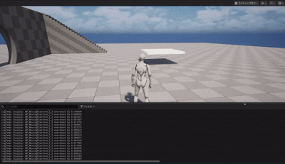

# 【UE5】足場の計算　オーバーシュート問題のログ取得と修正

# 目的
・現在地の取得では超過した場合の足場の戻り値がずれる可能性がある。  
・そのため足場の移動距離×足場の方向で元の開始地点へ追加をしながら正確な足場の終点を取得、開始地点も修正する  

# 要件
・ドット演算子を使用して移動する足場の速度を正規化したものを返す  
・移動方向×移動距離で増加させて停止する終点を取得させる  
・ログ上では足場が実際にどれだけ開始地点から超過したかを出力させる  
・それによって終点（戻る地点）を遡行的に取得させるしくみ  

# 結果
足場のログを取得。  
実際には内部で終点と開始地点が取得されて修正されているので座標超過問題を解決できた。  

# 感想
・開始地点から移動している現在地の取得する方法では終点がずれる場合の実装がなんとなく掴めたかも  
・内容よりもFベクトルと演算子、クラスの使い分けの区別の理解が重要  
・更新ごとに足場の位置が書き換わる場合、IF文の内部条件が変わってしまう  
・現在地点の取得のみだと各アクターに保存されている条件では適切に動かない場合などの修正に有効な気がする。  

